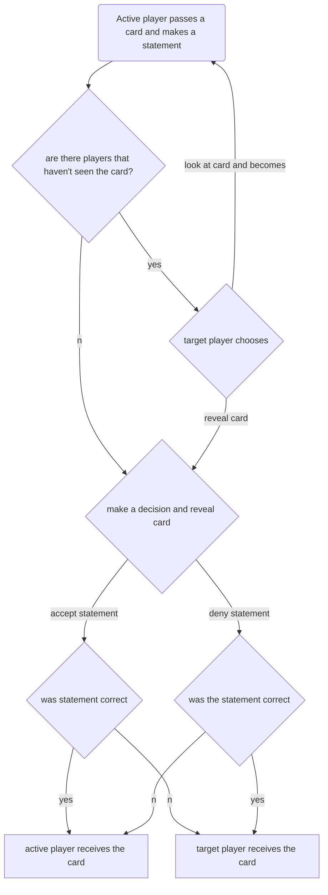

### Cockroach Poker
[BoardGameGeek](https://boardgamegeek.com/boardgame/11971/cockroach-poker)

```mermaid
graph TD;
    A(Active player passes a card and makes a statement)-->B;
    B{are there players that haven't seen the card?}--no-->E
    B--yes-->C
    C{target player chooses}--look at card and becomes-->A
    C--reveal card-->E
    E{make a decision and reveal card}--accept statement-->F
    E--deny statement-->G
    F{was statement correct}--yes-->H
    F--no-->I
    
    G{was the statement correct}--yes-->I
    G--no-->H

    H[active player receives the card]
    I[target player receives the card]
```
